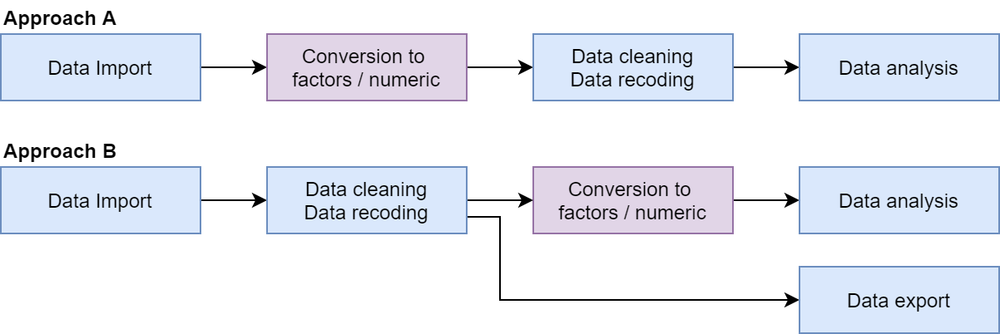

# Introduction to labelled

The purpose of the **labelled** package is to provide functions to
manipulate metadata as variable labels, value labels and defined missing
values using the `haven_labelled` and `haven_labelled_spss` classes
introduced in `haven` package.

These classes allow to add metadata (variable, value labels and
SPSS-style missing values) to vectors.

It should be noted that **value labels** doesn’t imply that your vectors
should be considered as categorical or continuous. Therefore, value
labels are not intended to be use for data analysis. For example, before
performing modeling, you should convert vectors with value labels into
factors or into classic numeric/character vectors.

Therefore, two main approaches could be considered.



Two main approaches

In **approach A**, `haven_labelled` vectors are converted into factors
or into numeric/character vectors just after data import, using
[`unlabelled()`](https://larmarange.github.io/labelled/dev/reference/to_factor.md),
[`to_factor()`](https://larmarange.github.io/labelled/dev/reference/to_factor.md)
or [`unclass()`](https://rdrr.io/r/base/class.html). Then, data
cleaning, recoding and analysis are performed using classic **R** vector
types.

In **approach B**, `haven_labelled` vectors are kept for data cleaning
and coding, allowing to preserved original recoding, in particular if
data should be reexported after that step. Functions provided by
`labelled` will be useful for managing value labels. However, as in
approach A, `haven_labelled` vectors will have to be converted into
classic factors or numeric vectors before data analysis (in particular
modeling) as this is the way categorical and continuous variables should
be coded for analysis functions.

## Variable labels

A variable label could be specified for any vector using
[`var_label()`](https://larmarange.github.io/labelled/dev/reference/var_label.md).

``` r
library(labelled)

var_label(iris$Sepal.Length) <- "Length of sepal"
```

It’s possible to add a variable label to several columns of a data frame
using a named list.

``` r
var_label(iris) <- list(
  Petal.Length = "Length of petal",
  Petal.Width = "Width of Petal"
)
```

To get the variable label, simply call
[`var_label()`](https://larmarange.github.io/labelled/dev/reference/var_label.md).

``` r
var_label(iris$Petal.Width)
```

    ## [1] "Width of Petal"

``` r
var_label(iris)
```

    ## $Sepal.Length
    ## [1] "Length of sepal"
    ## 
    ## $Sepal.Width
    ## NULL
    ## 
    ## $Petal.Length
    ## [1] "Length of petal"
    ## 
    ## $Petal.Width
    ## [1] "Width of Petal"
    ## 
    ## $Species
    ## NULL

To remove a variable label, use `NULL`.

``` r
var_label(iris$Sepal.Length) <- NULL
```

In **RStudio**, variable labels will be displayed in data viewer.

``` r
View(iris)
```

You can display and search through variable names and labels with
[`look_for()`](https://larmarange.github.io/labelled/dev/reference/look_for.md):

``` r
look_for(iris)
```

    ##  pos variable     label           col_type missing values    
    ##  1   Sepal.Length —               dbl      0                 
    ##  2   Sepal.Width  —               dbl      0                 
    ##  3   Petal.Length Length of petal dbl      0                 
    ##  4   Petal.Width  Width of Petal  dbl      0                 
    ##  5   Species      —               fct      0       setosa    
    ##                                                    versicolor
    ##                                                    virginica

``` r
look_for(iris, "pet")
```

    ##  pos variable     label           col_type missing values
    ##  3   Petal.Length Length of petal dbl      0             
    ##  4   Petal.Width  Width of Petal  dbl      0

``` r
look_for(iris, details = FALSE)
```

    ##  pos variable     label          
    ##  1   Sepal.Length —              
    ##  2   Sepal.Width  —              
    ##  3   Petal.Length Length of petal
    ##  4   Petal.Width  Width of Petal 
    ##  5   Species      —

## Value labels

The first way to create a labelled vector is to use the
[`labelled()`](https://haven.tidyverse.org/reference/labelled.html)
function. It’s not mandatory to provide a label for each value observed
in your vector. You can also provide a label for values not observed.

``` r
v <- labelled(
  c(1, 2, 2, 2, 3, 9, 1, 3, 2, NA),
  c(yes = 1, no = 3, "don't know" = 8, refused = 9)
)
v
```

    ## <labelled<double>[10]>
    ##  [1]  1  2  2  2  3  9  1  3  2 NA
    ## 
    ## Labels:
    ##  value      label
    ##      1        yes
    ##      3         no
    ##      8 don't know
    ##      9    refused

Use
[`val_labels()`](https://larmarange.github.io/labelled/dev/reference/val_labels.md)
to get all value labels and
[`val_label()`](https://larmarange.github.io/labelled/dev/reference/val_labels.md)
to get the value label associated with a specific value.

``` r
val_labels(v)
```

    ##        yes         no don't know    refused 
    ##          1          3          8          9

``` r
val_label(v, 8)
```

    ## [1] "don't know"

[`val_labels()`](https://larmarange.github.io/labelled/dev/reference/val_labels.md)
could also be used to modify all the value labels attached to a vector,
while
[`val_label()`](https://larmarange.github.io/labelled/dev/reference/val_labels.md)
will update only one specific value label.

``` r
val_labels(v) <- c(yes = 1, nno = 3, bug = 5)
v
```

    ## <labelled<double>[10]>
    ##  [1]  1  2  2  2  3  9  1  3  2 NA
    ## 
    ## Labels:
    ##  value label
    ##      1   yes
    ##      3   nno
    ##      5   bug

``` r
val_label(v, 3) <- "no"
v
```

    ## <labelled<double>[10]>
    ##  [1]  1  2  2  2  3  9  1  3  2 NA
    ## 
    ## Labels:
    ##  value label
    ##      1   yes
    ##      3    no
    ##      5   bug

With
[`val_label()`](https://larmarange.github.io/labelled/dev/reference/val_labels.md),
you can also add or remove specific value labels.

``` r
val_label(v, 2) <- "maybe"
val_label(v, 5) <- NULL
v
```

    ## <labelled<double>[10]>
    ##  [1]  1  2  2  2  3  9  1  3  2 NA
    ## 
    ## Labels:
    ##  value label
    ##      1   yes
    ##      3    no
    ##      2 maybe

To remove all value labels, use
[`val_labels()`](https://larmarange.github.io/labelled/dev/reference/val_labels.md)
and `NULL`. The `haven_labelled` class will also be removed.

``` r
val_labels(v) <- NULL
v
```

    ##  [1]  1  2  2  2  3  9  1  3  2 NA

Adding a value label to a non labelled vector will apply
`haven_labelled` class to it.

``` r
val_label(v, 1) <- "yes"
v
```

    ## <labelled<double>[10]>
    ##  [1]  1  2  2  2  3  9  1  3  2 NA
    ## 
    ## Labels:
    ##  value label
    ##      1   yes

Note that applying
[`val_labels()`](https://larmarange.github.io/labelled/dev/reference/val_labels.md)
to a factor will generate an error!

``` r
f <- factor(1:3)
f
```

    ## [1] 1 2 3
    ## Levels: 1 2 3

``` r
val_labels(f) <- c(yes = 1, no = 3)
```

    ## Error in `val_labels<-`:
    ## ! Value labels cannot be applied to factors.

You could also apply
[`val_labels()`](https://larmarange.github.io/labelled/dev/reference/val_labels.md)
to several columns of a data frame.

``` r
df <- data.frame(v1 = 1:3, v2 = c(2, 3, 1), v3 = 3:1)

val_label(df, 1) <- "yes"
val_label(df[, c("v1", "v3")], 2) <- "maybe"
val_label(df[, c("v2", "v3")], 3) <- "no"
val_labels(df)
```

    ## $v1
    ##   yes maybe 
    ##     1     2 
    ## 
    ## $v2
    ## yes  no 
    ##   1   3 
    ## 
    ## $v3
    ##   yes maybe    no 
    ##     1     2     3

``` r
val_labels(df[, c("v1", "v3")]) <- c(YES = 1, MAYBE = 2, NO = 3)
val_labels(df)
```

    ## $v1
    ##   YES MAYBE    NO 
    ##     1     2     3 
    ## 
    ## $v2
    ## yes  no 
    ##   1   3 
    ## 
    ## $v3
    ##   YES MAYBE    NO 
    ##     1     2     3

``` r
val_labels(df) <- NULL
val_labels(df)
```

    ## $v1
    ## NULL
    ## 
    ## $v2
    ## NULL
    ## 
    ## $v3
    ## NULL

``` r
val_labels(df) <- list(v1 = c(yes = 1, no = 3), v2 = c(a = 1, b = 2, c = 3))
val_labels(df)
```

    ## $v1
    ## yes  no 
    ##   1   3 
    ## 
    ## $v2
    ## a b c 
    ## 1 2 3 
    ## 
    ## $v3
    ## NULL

## Sorting value labels

Value labels are sorted by default in the order they have been created.

``` r
v <- c(1, 2, 2, 2, 3, 9, 1, 3, 2, NA)
val_label(v, 1) <- "yes"
val_label(v, 3) <- "no"
val_label(v, 9) <- "refused"
val_label(v, 2) <- "maybe"
val_label(v, 8) <- "don't know"
v
```

    ## <labelled<double>[10]>
    ##  [1]  1  2  2  2  3  9  1  3  2 NA
    ## 
    ## Labels:
    ##  value      label
    ##      1        yes
    ##      3         no
    ##      9    refused
    ##      2      maybe
    ##      8 don't know

It could be useful to reorder the value labels according to their
attached values, with
[`sort_val_labels()`](https://larmarange.github.io/labelled/dev/reference/sort_val_labels.md).

``` r
sort_val_labels(v)
```

    ## <labelled<double>[10]>
    ##  [1]  1  2  2  2  3  9  1  3  2 NA
    ## 
    ## Labels:
    ##  value      label
    ##      1        yes
    ##      2      maybe
    ##      3         no
    ##      8 don't know
    ##      9    refused

``` r
sort_val_labels(v, decreasing = TRUE)
```

    ## <labelled<double>[10]>
    ##  [1]  1  2  2  2  3  9  1  3  2 NA
    ## 
    ## Labels:
    ##  value      label
    ##      9    refused
    ##      8 don't know
    ##      3         no
    ##      2      maybe
    ##      1        yes

If you prefer, you can also sort them according to the labels.

``` r
sort_val_labels(v, according_to = "l")
```

    ## <labelled<double>[10]>
    ##  [1]  1  2  2  2  3  9  1  3  2 NA
    ## 
    ## Labels:
    ##  value      label
    ##      8 don't know
    ##      2      maybe
    ##      3         no
    ##      9    refused
    ##      1        yes

## User defined missing values (SPSS’s style)

`haven` (\>= 2.0.0) introduced an additional `haven_labelled_spss` class
to deal with user defined missing values. In such case, additional
attributes will be used to indicate with values should be considered as
missing, but such values will not be stored as internal `NA` values. You
should note that most R function will not take this information into
account. Therefore, you will have to convert missing values into `NA` if
required before analysis. These defined missing values could co-exist
with internal `NA` values.

It is possible to manipulate this missing values with
[`na_values()`](https://larmarange.github.io/labelled/dev/reference/na_values.md)
and
[`na_range()`](https://larmarange.github.io/labelled/dev/reference/na_values.md).
Note that [`is.na()`](https://rdrr.io/r/base/NA.html) will return `TRUE`
as well for user-defined missing values.

``` r
v <- labelled(
  c(1, 2, 2, 2, 3, 9, 1, 3, 2, NA),
  c(yes = 1, no = 3, "don't know" = 9)
)
v
```

    ## <labelled<double>[10]>
    ##  [1]  1  2  2  2  3  9  1  3  2 NA
    ## 
    ## Labels:
    ##  value      label
    ##      1        yes
    ##      3         no
    ##      9 don't know

``` r
na_values(v) <- 9
na_values(v)
```

    ## [1] 9

``` r
v
```

    ## <labelled_spss<double>[10]>
    ##  [1]  1  2  2  2  3  9  1  3  2 NA
    ## Missing values: 9
    ## 
    ## Labels:
    ##  value      label
    ##      1        yes
    ##      3         no
    ##      9 don't know

``` r
is.na(v)
```

    ##  [1] FALSE FALSE FALSE FALSE FALSE  TRUE FALSE FALSE FALSE  TRUE

``` r
na_values(v) <- NULL
v
```

    ## <labelled<double>[10]>
    ##  [1]  1  2  2  2  3  9  1  3  2 NA
    ## 
    ## Labels:
    ##  value      label
    ##      1        yes
    ##      3         no
    ##      9 don't know

``` r
na_range(v) <- c(5, Inf)
na_range(v)
```

    ## [1]   5 Inf

``` r
v
```

    ## <labelled_spss<double>[10]>
    ##  [1]  1  2  2  2  3  9  1  3  2 NA
    ## Missing range:  [5, Inf]
    ## 
    ## Labels:
    ##  value      label
    ##      1        yes
    ##      3         no
    ##      9 don't know

Since version 2.1.0, it is not mandatory to define at least one value
label before defining missing values.

``` r
x <- c(1, 2, 2, 9)
na_values(x) <- 9
x
```

    ## <labelled_spss<double>[4]>
    ## [1] 1 2 2 9
    ## Missing values: 9

To convert user defined missing values into `NA`, simply use
[`user_na_to_na()`](https://larmarange.github.io/labelled/dev/reference/na_values.md).

``` r
v <- labelled_spss(1:10, c(Good = 1, Bad = 8), na_values = c(9, 10))
v
```

    ## <labelled_spss<integer>[10]>
    ##  [1]  1  2  3  4  5  6  7  8  9 10
    ## Missing values: 9, 10
    ## 
    ## Labels:
    ##  value label
    ##      1  Good
    ##      8   Bad

``` r
v2 <- user_na_to_na(v)
v2
```

    ## <labelled<integer>[10]>
    ##  [1]  1  2  3  4  5  6  7  8 NA NA
    ## 
    ## Labels:
    ##  value label
    ##      1  Good
    ##      8   Bad

You can also remove user missing values definition without converting
these values to `NA`.

``` r
v <- labelled_spss(1:10, c(Good = 1, Bad = 8), na_values = c(9, 10))
v
```

    ## <labelled_spss<integer>[10]>
    ##  [1]  1  2  3  4  5  6  7  8  9 10
    ## Missing values: 9, 10
    ## 
    ## Labels:
    ##  value label
    ##      1  Good
    ##      8   Bad

``` r
v2 <- remove_user_na(v)
v2
```

    ## <labelled<integer>[10]>
    ##  [1]  1  2  3  4  5  6  7  8  9 10
    ## 
    ## Labels:
    ##  value label
    ##      1  Good
    ##      8   Bad

or

``` r
v <- labelled_spss(1:10, c(Good = 1, Bad = 8), na_values = c(9, 10))
v
```

    ## <labelled_spss<integer>[10]>
    ##  [1]  1  2  3  4  5  6  7  8  9 10
    ## Missing values: 9, 10
    ## 
    ## Labels:
    ##  value label
    ##      1  Good
    ##      8   Bad

``` r
na_values(v) <- NULL
v
```

    ## <labelled<integer>[10]>
    ##  [1]  1  2  3  4  5  6  7  8  9 10
    ## 
    ## Labels:
    ##  value label
    ##      1  Good
    ##      8   Bad

## Other conversion to NA

In some cases, values who don’t have an attached value label could be
considered as missing.
[`nolabel_to_na()`](https://larmarange.github.io/labelled/dev/reference/nolabel_to_na.md)
will convert them to `NA`.

``` r
v <- labelled(c(1, 2, 2, 2, 3, 9, 1, 3, 2, NA), c(yes = 1, maybe = 2, no = 3))
v
```

    ## <labelled<double>[10]>
    ##  [1]  1  2  2  2  3  9  1  3  2 NA
    ## 
    ## Labels:
    ##  value label
    ##      1   yes
    ##      2 maybe
    ##      3    no

``` r
nolabel_to_na(v)
```

    ## <labelled<double>[10]>
    ##  [1]  1  2  2  2  3 NA  1  3  2 NA
    ## 
    ## Labels:
    ##  value label
    ##      1   yes
    ##      2 maybe
    ##      3    no

In other cases, a value label is attached only to specific values that
corresponds to a missing value. For example:

``` r
size <- labelled(c(1.88, 1.62, 1.78, 99, 1.91), c("not measured" = 99))
size
```

    ## <labelled<double>[5]>
    ## [1]  1.88  1.62  1.78 99.00  1.91
    ## 
    ## Labels:
    ##  value        label
    ##     99 not measured

In such cases,
[`val_labels_to_na()`](https://larmarange.github.io/labelled/dev/reference/val_labels_to_na.md)
could be appropriate.

``` r
val_labels_to_na(size)
```

    ## [1] 1.88 1.62 1.78   NA 1.91

These two functions could also be applied to an overall data frame. Only
labelled vectors will be impacted.

## Converting to factor

A labelled vector could easily be converted to a factor with
[`to_factor()`](https://larmarange.github.io/labelled/dev/reference/to_factor.md).

``` r
v <- labelled(
  c(1, 2, 2, 2, 3, 9, 1, 3, 2, NA),
  c(yes = 1, no = 3, "don't know" = 8, refused = 9)
)
v
```

    ## <labelled<double>[10]>
    ##  [1]  1  2  2  2  3  9  1  3  2 NA
    ## 
    ## Labels:
    ##  value      label
    ##      1        yes
    ##      3         no
    ##      8 don't know
    ##      9    refused

``` r
to_factor(v)
```

    ##  [1] yes     2       2       2       no      refused yes     no      2      
    ## [10] <NA>   
    ## Levels: yes 2 no don't know refused

The `levels` argument allows to specify what should be used as the
factor levels, i.e. the labels (default), the values or the labels
prefixed with values.

``` r
to_factor(v, levels = "v")
```

    ##  [1] 1    2    2    2    3    9    1    3    2    <NA>
    ## Levels: 1 2 3 8 9

``` r
to_factor(v, levels = "p")
```

    ##  [1] [1] yes     [2] 2       [2] 2       [2] 2       [3] no      [9] refused
    ##  [7] [1] yes     [3] no      [2] 2       <NA>       
    ## Levels: [1] yes [2] 2 [3] no [8] don't know [9] refused

The `ordered` argument will create an ordinal factor.

``` r
to_factor(v, ordered = TRUE)
```

    ##  [1] yes     2       2       2       no      refused yes     no      2      
    ## [10] <NA>   
    ## Levels: yes < 2 < no < don't know < refused

The argument `nolabel_to_na` specify if the corresponding function
should be applied before converting to a factor. Therefore, the two
following commands are equivalent.

``` r
to_factor(v, nolabel_to_na = TRUE)
```

    ##  [1] yes     <NA>    <NA>    <NA>    no      refused yes     no      <NA>   
    ## [10] <NA>   
    ## Levels: yes no don't know refused

``` r
to_factor(nolabel_to_na(v))
```

    ##  [1] yes     <NA>    <NA>    <NA>    no      refused yes     no      <NA>   
    ## [10] <NA>   
    ## Levels: yes no don't know refused

`sort_levels` specifies how the levels should be sorted: `"none"` to
keep the order in which value labels have been defined, `"values"` to
order the levels according to the values and `"labels"` according to the
labels. `"auto"` (default) will be equivalent to `"none"` except if some
values with no attached labels are found and are not dropped. In that
case, `"values"` will be used.

``` r
to_factor(v, sort_levels = "n")
```

    ##  [1] yes     2       2       2       no      refused yes     no      2      
    ## [10] <NA>   
    ## Levels: yes no don't know refused 2

``` r
to_factor(v, sort_levels = "v")
```

    ##  [1] yes     2       2       2       no      refused yes     no      2      
    ## [10] <NA>   
    ## Levels: yes 2 no don't know refused

``` r
to_factor(v, sort_levels = "l")
```

    ##  [1] yes     2       2       2       no      refused yes     no      2      
    ## [10] <NA>   
    ## Levels: 2 don't know no refused yes

The function
[`to_labelled()`](https://larmarange.github.io/labelled/dev/reference/to_labelled.md)
could be used to turn a factor into a labelled numeric vector.

``` r
f <- factor(1:3, labels = c("a", "b", "c"))
to_labelled(f)
```

    ## <labelled<double>[3]>
    ## [1] 1 2 3
    ## 
    ## Labels:
    ##  value label
    ##      1     a
    ##      2     b
    ##      3     c

Note that `to_labelled(to_factor(v))` will not be equal to `v` due to
the way factors are stored internally by **R**.

``` r
v
```

    ## <labelled<double>[10]>
    ##  [1]  1  2  2  2  3  9  1  3  2 NA
    ## 
    ## Labels:
    ##  value      label
    ##      1        yes
    ##      3         no
    ##      8 don't know
    ##      9    refused

``` r
to_labelled(to_factor(v))
```

    ## <labelled<double>[10]>
    ##  [1]  1  2  2  2  3  5  1  3  2 NA
    ## 
    ## Labels:
    ##  value      label
    ##      1        yes
    ##      2          2
    ##      3         no
    ##      4 don't know
    ##      5    refused

## Other type of conversions

You can use
[`to_character()`](https://larmarange.github.io/labelled/dev/reference/to_character.md)
for converting into a character vector instead of a factor.

``` r
v
```

    ## <labelled<double>[10]>
    ##  [1]  1  2  2  2  3  9  1  3  2 NA
    ## 
    ## Labels:
    ##  value      label
    ##      1        yes
    ##      3         no
    ##      8 don't know
    ##      9    refused

``` r
to_character(v)
```

    ##  [1] "yes"     "2"       "2"       "2"       "no"      "refused" "yes"    
    ##  [8] "no"      "2"       NA

To remove the `haven_class`, you can simply use
[`unclass()`](https://rdrr.io/r/base/class.html).

``` r
unclass(v)
```

    ##  [1]  1  2  2  2  3  9  1  3  2 NA
    ## attr(,"labels")
    ##        yes         no don't know    refused 
    ##          1          3          8          9

Note that value labels will be preserved as an attribute to the vector.

``` r
remove_val_labels(v)
```

    ##  [1]  1  2  2  2  3  9  1  3  2 NA

To remove value labels, use
[`remove_val_labels()`](https://larmarange.github.io/labelled/dev/reference/remove_labels.md).

``` r
remove_val_labels(v)
```

    ##  [1]  1  2  2  2  3  9  1  3  2 NA

Note that if your vector does have user-defined missing values, you may
also want to use
[`remove_user_na()`](https://larmarange.github.io/labelled/dev/reference/remove_labels.md).

``` r
x <- c(1, 2, 2, 9)
na_values(x) <- 9
val_labels(x) <- c(yes = 1, no = 2)
var_label(x) <- "A test variable"
x
```

    ## <labelled_spss<double>[4]>: A test variable
    ## [1] 1 2 2 9
    ## Missing values: 9
    ## 
    ## Labels:
    ##  value label
    ##      1   yes
    ##      2    no

``` r
remove_val_labels(x)
```

    ## <labelled_spss<double>[4]>: A test variable
    ## [1] 1 2 2 9
    ## Missing values: 9

``` r
remove_user_na(x)
```

    ## <labelled<double>[4]>: A test variable
    ## [1] 1 2 2 9
    ## 
    ## Labels:
    ##  value label
    ##      1   yes
    ##      2    no

``` r
remove_user_na(x, user_na_to_na = TRUE)
```

    ## <labelled<double>[4]>: A test variable
    ## [1]  1  2  2 NA
    ## 
    ## Labels:
    ##  value label
    ##      1   yes
    ##      2    no

``` r
remove_val_labels(remove_user_na(x))
```

    ## [1] 1 2 2 9
    ## attr(,"label")
    ## [1] "A test variable"

``` r
unclass(x)
```

    ## [1] 1 2 2 9
    ## attr(,"labels")
    ## yes  no 
    ##   1   2 
    ## attr(,"na_values")
    ## [1] 9
    ## attr(,"label")
    ## [1] "A test variable"

You can remove all labels and user-defined missing values with
[`remove_labels()`](https://larmarange.github.io/labelled/dev/reference/remove_labels.md).
Use `keep_var_label = TRUE` to preserve only variable label.

``` r
remove_labels(x, user_na_to_na = TRUE)
```

    ## [1]  1  2  2 NA

``` r
remove_labels(x, user_na_to_na = TRUE, keep_var_label = TRUE)
```

    ## [1]  1  2  2 NA
    ## attr(,"label")
    ## [1] "A test variable"

## Conditional conversion to factors

For any analysis, it is the responsibility of user to identify which
labelled numeric vectors should be considered as **categorical** (and
therefore converted into factors using
[`to_factor()`](https://larmarange.github.io/labelled/dev/reference/to_factor.md))
and which variables should be treated as **continuous** (and therefore
unclassed into numeric using
[`base::unclass()`](https://rdrr.io/r/base/class.html)).

It should be noted that most functions expect categorical variables to
be coded as factors. It includes most modeling functions (such as
[`stats::lm()`](https://rdrr.io/r/stats/lm.html) or
[`stats::glm()`](https://rdrr.io/r/stats/glm.html)) or plotting
functions from `ggplot2`.

In most of cases, if data documentation was properly done, categorical
variables corresponds to vectors where all observed values have a value
label while vectors where only few values have a value label should be
considered as continuous.

In that situation, you could apply the
[`unlabelled()`](https://larmarange.github.io/labelled/dev/reference/to_factor.md)
method to an overall data frame. By default,
[`unlabelled()`](https://larmarange.github.io/labelled/dev/reference/to_factor.md)
works as follow:

- if a column doesn’t inherit the `haven_labelled` class, it will be not
  affected;
- if all observed values have a corresponding value label, the column
  will be converted into a factor (using
  [`to_factor()`](https://larmarange.github.io/labelled/dev/reference/to_factor.md));
- otherwise, the column will be unclassed (and converted back to a
  numeric or character vector by applying
  [`base::unclass()`](https://rdrr.io/r/base/class.html)).

``` r
df <- data.frame(
  a = labelled(c(1, 1, 2, 3), labels = c(No = 1, Yes = 2)),
  b = labelled(c(1, 1, 2, 3), labels = c(No = 1, Yes = 2, DK = 3)),
  c = labelled(c(1, 1, 2, 2), labels = c(No = 1, Yes = 2, DK = 3)),
  d = labelled(c("a", "a", "b", "c"), labels = c(No = "a", Yes = "b")),
  e = labelled_spss(
    c(1, 9, 1, 2),
    labels = c(No = 1, Yes = 2),
    na_values = 9
  )
)
df %>% look_for()
```

    ##  pos variable label col_type missing values 
    ##  1   a        —     dbl+lbl  0       [1] No 
    ##                                      [2] Yes
    ##  2   b        —     dbl+lbl  0       [1] No 
    ##                                      [2] Yes
    ##                                      [3] DK 
    ##  3   c        —     dbl+lbl  0       [1] No 
    ##                                      [2] Yes
    ##                                      [3] DK 
    ##  4   d        —     chr+lbl  0       [a] No 
    ##                                      [b] Yes
    ##  5   e        —     dbl+lbl  1       [1] No 
    ##                                      [2] Yes

``` r
unlabelled(df) %>% look_for()
```

    ##  pos variable label col_type missing values
    ##  1   a        —     dbl      0             
    ##  2   b        —     fct      0       No    
    ##                                      Yes   
    ##                                      DK    
    ##  3   c        —     fct      0       No    
    ##                                      Yes   
    ##                                      DK    
    ##  4   d        —     chr      0             
    ##  5   e        —     fct      1       No    
    ##                                      Yes

``` r
unlabelled(df, user_na_to_na = TRUE) %>% look_for()
```

    ##  pos variable label col_type missing values
    ##  1   a        —     dbl      0             
    ##  2   b        —     fct      0       No    
    ##                                      Yes   
    ##                                      DK    
    ##  3   c        —     fct      0       No    
    ##                                      Yes   
    ##                                      DK    
    ##  4   d        —     chr      0             
    ##  5   e        —     fct      1       No    
    ##                                      Yes

``` r
unlabelled(df, drop_unused_labels = TRUE) %>% look_for()
```

    ##  pos variable label col_type missing values
    ##  1   a        —     dbl      0             
    ##  2   b        —     fct      0       No    
    ##                                      Yes   
    ##                                      DK    
    ##  3   c        —     fct      0       No    
    ##                                      Yes   
    ##  4   d        —     chr      0             
    ##  5   e        —     fct      1       No    
    ##                                      Yes

## Importing labelled data

In **haven** package, `read_spss`, `read_stata` and `read_sas` are
natively importing data using the `labelled` class and the `label`
attribute for variable labels.

Functions from **foreign** package could also import some metadata from
**SPSS** and **Stata** files. `to_labelled` can convert data imported
with **foreign** into a labelled data frame. However, there are some
limitations compared to using **haven**:

- For **SPSS** files, it will be better to set
  `use.value.labels = FALSE`, `to.data.frame = FALSE` and
  `use.missings = FALSE` when calling `read.spss`. If
  `use.value.labels = TRUE`, variable with value labels will be
  converted into factors by `read.spss` (and kept as factors by
  `foreign_to_label`). If `to.data.frame = TRUE`, meta data describing
  the missing values will not be imported. If `use.missings = TRUE`,
  missing values would have been converted to `NA` by `read.spss`.
- For **Stata** files, set `convert.factors = FALSE` when calling
  `read.dta` to avoid conversion of variables with value labels into
  factors. So far, missing values defined in Stata are always imported
  as `NA` by `read.dta` and could not be retrieved by
  `foreign_to_labelled`.

The **memisc** package provide functions to import variable metadata and
store them in specific object of class `data.set`. The `to_labelled`
method can convert a data.set into a labelled data frame.

``` r
# from foreign
library(foreign)
df <- to_labelled(read.spss(
  "file.sav",
  to.data.frame = FALSE,
  use.value.labels = FALSE,
  use.missings = FALSE
))
df <- to_labelled(read.dta(
  "file.dta",
  convert.factors = FALSE
))

# from memisc
library(memisc)
nes1948.por <- UnZip("anes/NES1948.ZIP", "NES1948.POR", package = "memisc")
nes1948 <- spss.portable.file(nes1948.por)
df <- to_labelled(nes1948)
ds <- as.data.set(nes19480)
df <- to_labelled(ds)
```

## Using labelled with dplyr/magrittr

If you are using the `%>%` operator, you can use the functions
[`set_variable_labels()`](https://larmarange.github.io/labelled/dev/reference/var_label.md),
[`set_value_labels()`](https://larmarange.github.io/labelled/dev/reference/val_labels.md),
[`add_value_labels()`](https://larmarange.github.io/labelled/dev/reference/val_labels.md)
and
[`remove_value_labels()`](https://larmarange.github.io/labelled/dev/reference/val_labels.md).

``` r
library(dplyr)
```

    ## 
    ## Attaching package: 'dplyr'

    ## The following objects are masked from 'package:stats':
    ## 
    ##     filter, lag

    ## The following objects are masked from 'package:base':
    ## 
    ##     intersect, setdiff, setequal, union

``` r
df <- tibble(s1 = c("M", "M", "F"), s2 = c(1, 1, 2)) %>%
  set_variable_labels(s1 = "Sex", s2 = "Question") %>%
  set_value_labels(s1 = c(Male = "M", Female = "F"), s2 = c(Yes = 1, No = 2))
df$s2
```

    ## <labelled<double>[3]>: Question
    ## [1] 1 1 2
    ## 
    ## Labels:
    ##  value label
    ##      1   Yes
    ##      2    No

[`set_value_labels()`](https://larmarange.github.io/labelled/dev/reference/val_labels.md)
will replace the list of value labels while
[`add_value_labels()`](https://larmarange.github.io/labelled/dev/reference/val_labels.md)
will update it.

``` r
df <- df %>%
  set_value_labels(s2 = c(Yes = 1, "Don't know" = 8, Unknown = 9))
df$s2
```

    ## <labelled<double>[3]>: Question
    ## [1] 1 1 2
    ## 
    ## Labels:
    ##  value      label
    ##      1        Yes
    ##      8 Don't know
    ##      9    Unknown

``` r
df <- df %>%
  add_value_labels(s2 = c(No = 2))
df$s2
```

    ## <labelled<double>[3]>: Question
    ## [1] 1 1 2
    ## 
    ## Labels:
    ##  value      label
    ##      1        Yes
    ##      8 Don't know
    ##      9    Unknown
    ##      2         No

You can also remove some variable and/or value labels.

``` r
df <- df %>%
  set_variable_labels(s1 = NULL)

# removing one value label
df <- df %>%
  remove_value_labels(s2 = 2)
df$s2
```

    ## <labelled<double>[3]>: Question
    ## [1] 1 1 2
    ## 
    ## Labels:
    ##  value      label
    ##      1        Yes
    ##      8 Don't know
    ##      9    Unknown

``` r
# removing several value labels
df <- df %>%
  remove_value_labels(s2 = 8:9)
df$s2
```

    ## <labelled<double>[3]>: Question
    ## [1] 1 1 2
    ## 
    ## Labels:
    ##  value label
    ##      1   Yes

``` r
# removing all value labels
df <- df %>%
  set_value_labels(s2 = NULL)
df$s2
```

    ## [1] 1 1 2
    ## attr(,"label")
    ## [1] "Question"

To convert variables, the easiest is to use
[`unlabelled()`](https://larmarange.github.io/labelled/dev/reference/to_factor.md).

``` r
library(questionr)
data(fertility)
glimpse(women)
```

    ## Rows: 2,000
    ## Columns: 17
    ## $ id_woman          <dbl> 391, 1643, 85, 881, 1981, 1072, 1978, 1607, 738, 165…
    ## $ id_household      <dbl> 381, 1515, 85, 844, 1797, 1015, 1794, 1486, 711, 152…
    ## $ weight            <dbl> 1.803150, 1.803150, 1.803150, 1.803150, 1.803150, 0.…
    ## $ interview_date    <date> 2012-05-05, 2012-01-23, 2012-01-21, 2012-01-06, 201…
    ## $ date_of_birth     <date> 1997-03-07, 1982-01-06, 1979-01-01, 1968-03-29, 198…
    ## $ age               <dbl> 15, 30, 33, 43, 25, 18, 45, 23, 49, 31, 26, 45, 25, …
    ## $ residency         <dbl+lbl> 2, 2, 2, 2, 2, 2, 2, 2, 2, 2, 2, 2, 2, 2, 2, 2, …
    ## $ region            <dbl+lbl> 4, 4, 4, 4, 4, 3, 3, 3, 3, 3, 3, 3, 2, 2, 2, 2, …
    ## $ instruction       <dbl+lbl> 0, 0, 0, 0, 1, 0, 0, 0, 0, 0, 0, 1, 1, 2, 1, 0, …
    ## $ employed          <dbl+lbl> 1, 1, 0, 1, 1, 0, 1, 0, 1, 1, 1, 1, 1, 1, 1, 1, …
    ## $ matri             <dbl+lbl> 0, 2, 2, 2, 1, 0, 1, 1, 2, 5, 2, 3, 0, 2, 1, 2, …
    ## $ religion          <dbl+lbl> 1, 3, 2, 3, 2, 2, 3, 1, 3, 3, 2, 3, 2, 2, 2, 2, …
    ## $ newspaper         <dbl+lbl> 0, 0, 0, 0, 0, 0, 0, 0, 0, 0, 0, 0, 0, 1, 0, 0, …
    ## $ radio             <dbl+lbl> 0, 1, 1, 0, 0, 1, 1, 0, 0, 0, 1, 1, 1, 1, 1, 0, …
    ## $ tv                <dbl+lbl> 0, 0, 0, 0, 0, 1, 0, 0, 0, 0, 1, 1, 0, 0, 0, 0, …
    ## $ ideal_nb_children <dbl+lbl>  4,  4,  4,  4,  4,  5, 10,  5,  4,  5,  6, 10, …
    ## $ test              <dbl+lbl> 0, 9, 0, 0, 1, 0, 0, 0, 0, 1, 1, 0, 0, 1, 1, 0, …

``` r
glimpse(women %>% unlabelled())
```

    ## Rows: 2,000
    ## Columns: 17
    ## $ id_woman          <dbl> 391, 1643, 85, 881, 1981, 1072, 1978, 1607, 738, 165…
    ## $ id_household      <dbl> 381, 1515, 85, 844, 1797, 1015, 1794, 1486, 711, 152…
    ## $ weight            <dbl> 1.803150, 1.803150, 1.803150, 1.803150, 1.803150, 0.…
    ## $ interview_date    <date> 2012-05-05, 2012-01-23, 2012-01-21, 2012-01-06, 201…
    ## $ date_of_birth     <date> 1997-03-07, 1982-01-06, 1979-01-01, 1968-03-29, 198…
    ## $ age               <dbl> 15, 30, 33, 43, 25, 18, 45, 23, 49, 31, 26, 45, 25, …
    ## $ residency         <fct> rural, rural, rural, rural, rural, rural, rural, rur…
    ## $ region            <fct> West, West, West, West, West, South, South, South, S…
    ## $ instruction       <fct> none, none, none, none, primary, none, none, none, n…
    ## $ employed          <fct> yes, yes, no, yes, yes, no, yes, no, yes, yes, yes, …
    ## $ matri             <fct> single, living together, living together, living tog…
    ## $ religion          <fct> Muslim, Protestant, Christian, Protestant, Christian…
    ## $ newspaper         <fct> no, no, no, no, no, no, no, no, no, no, no, no, no, …
    ## $ radio             <fct> no, yes, yes, no, no, yes, yes, no, no, no, yes, yes…
    ## $ tv                <fct> no, no, no, no, no, yes, no, no, no, no, yes, yes, n…
    ## $ ideal_nb_children <dbl> 4, 4, 4, 4, 4, 5, 10, 5, 4, 5, 6, 10, 2, 6, 6, 6, 4,…
    ## $ test              <fct> no, missing, no, no, yes, no, no, no, no, yes, yes, …

Alternatively, you can use functions as
[`dplyr::mutate()`](https://dplyr.tidyverse.org/reference/mutate.html) +
[`dplyr::across()`](https://dplyr.tidyverse.org/reference/across.html).
See the example below.

``` r
glimpse(to_factor(women))
```

    ## Rows: 2,000
    ## Columns: 17
    ## $ id_woman          <dbl> 391, 1643, 85, 881, 1981, 1072, 1978, 1607, 738, 165…
    ## $ id_household      <dbl> 381, 1515, 85, 844, 1797, 1015, 1794, 1486, 711, 152…
    ## $ weight            <dbl> 1.803150, 1.803150, 1.803150, 1.803150, 1.803150, 0.…
    ## $ interview_date    <date> 2012-05-05, 2012-01-23, 2012-01-21, 2012-01-06, 201…
    ## $ date_of_birth     <date> 1997-03-07, 1982-01-06, 1979-01-01, 1968-03-29, 198…
    ## $ age               <dbl> 15, 30, 33, 43, 25, 18, 45, 23, 49, 31, 26, 45, 25, …
    ## $ residency         <fct> rural, rural, rural, rural, rural, rural, rural, rur…
    ## $ region            <fct> West, West, West, West, West, South, South, South, S…
    ## $ instruction       <fct> none, none, none, none, primary, none, none, none, n…
    ## $ employed          <fct> yes, yes, no, yes, yes, no, yes, no, yes, yes, yes, …
    ## $ matri             <fct> single, living together, living together, living tog…
    ## $ religion          <fct> Muslim, Protestant, Christian, Protestant, Christian…
    ## $ newspaper         <fct> no, no, no, no, no, no, no, no, no, no, no, no, no, …
    ## $ radio             <fct> no, yes, yes, no, no, yes, yes, no, no, no, yes, yes…
    ## $ tv                <fct> no, no, no, no, no, yes, no, no, no, no, yes, yes, n…
    ## $ ideal_nb_children <fct> 4, 4, 4, 4, 4, 5, 10, 5, 4, 5, 6, 10, 2, 6, 6, 6, 4,…
    ## $ test              <fct> no, missing, no, no, yes, no, no, no, no, yes, yes, …

``` r
glimpse(women %>% mutate(across(where(is.labelled), to_factor)))
```

    ## Rows: 2,000
    ## Columns: 17
    ## $ id_woman          <dbl> 391, 1643, 85, 881, 1981, 1072, 1978, 1607, 738, 165…
    ## $ id_household      <dbl> 381, 1515, 85, 844, 1797, 1015, 1794, 1486, 711, 152…
    ## $ weight            <dbl> 1.803150, 1.803150, 1.803150, 1.803150, 1.803150, 0.…
    ## $ interview_date    <date> 2012-05-05, 2012-01-23, 2012-01-21, 2012-01-06, 201…
    ## $ date_of_birth     <date> 1997-03-07, 1982-01-06, 1979-01-01, 1968-03-29, 198…
    ## $ age               <dbl> 15, 30, 33, 43, 25, 18, 45, 23, 49, 31, 26, 45, 25, …
    ## $ residency         <fct> rural, rural, rural, rural, rural, rural, rural, rur…
    ## $ region            <fct> West, West, West, West, West, South, South, South, S…
    ## $ instruction       <fct> none, none, none, none, primary, none, none, none, n…
    ## $ employed          <fct> yes, yes, no, yes, yes, no, yes, no, yes, yes, yes, …
    ## $ matri             <fct> single, living together, living together, living tog…
    ## $ religion          <fct> Muslim, Protestant, Christian, Protestant, Christian…
    ## $ newspaper         <fct> no, no, no, no, no, no, no, no, no, no, no, no, no, …
    ## $ radio             <fct> no, yes, yes, no, no, yes, yes, no, no, no, yes, yes…
    ## $ tv                <fct> no, no, no, no, no, yes, no, no, no, no, yes, yes, n…
    ## $ ideal_nb_children <fct> 4, 4, 4, 4, 4, 5, 10, 5, 4, 5, 6, 10, 2, 6, 6, 6, 4,…
    ## $ test              <fct> no, missing, no, no, yes, no, no, no, no, yes, yes, …

``` r
glimpse(women %>% mutate(across(employed:religion, to_factor)))
```

    ## Rows: 2,000
    ## Columns: 17
    ## $ id_woman          <dbl> 391, 1643, 85, 881, 1981, 1072, 1978, 1607, 738, 165…
    ## $ id_household      <dbl> 381, 1515, 85, 844, 1797, 1015, 1794, 1486, 711, 152…
    ## $ weight            <dbl> 1.803150, 1.803150, 1.803150, 1.803150, 1.803150, 0.…
    ## $ interview_date    <date> 2012-05-05, 2012-01-23, 2012-01-21, 2012-01-06, 201…
    ## $ date_of_birth     <date> 1997-03-07, 1982-01-06, 1979-01-01, 1968-03-29, 198…
    ## $ age               <dbl> 15, 30, 33, 43, 25, 18, 45, 23, 49, 31, 26, 45, 25, …
    ## $ residency         <dbl+lbl> 2, 2, 2, 2, 2, 2, 2, 2, 2, 2, 2, 2, 2, 2, 2, 2, …
    ## $ region            <dbl+lbl> 4, 4, 4, 4, 4, 3, 3, 3, 3, 3, 3, 3, 2, 2, 2, 2, …
    ## $ instruction       <dbl+lbl> 0, 0, 0, 0, 1, 0, 0, 0, 0, 0, 0, 1, 1, 2, 1, 0, …
    ## $ employed          <fct> yes, yes, no, yes, yes, no, yes, no, yes, yes, yes, …
    ## $ matri             <fct> single, living together, living together, living tog…
    ## $ religion          <fct> Muslim, Protestant, Christian, Protestant, Christian…
    ## $ newspaper         <dbl+lbl> 0, 0, 0, 0, 0, 0, 0, 0, 0, 0, 0, 0, 0, 1, 0, 0, …
    ## $ radio             <dbl+lbl> 0, 1, 1, 0, 0, 1, 1, 0, 0, 0, 1, 1, 1, 1, 1, 0, …
    ## $ tv                <dbl+lbl> 0, 0, 0, 0, 0, 1, 0, 0, 0, 0, 1, 1, 0, 0, 0, 0, …
    ## $ ideal_nb_children <dbl+lbl>  4,  4,  4,  4,  4,  5, 10,  5,  4,  5,  6, 10, …
    ## $ test              <dbl+lbl> 0, 9, 0, 0, 1, 0, 0, 0, 0, 1, 1, 0, 0, 1, 1, 0, …
